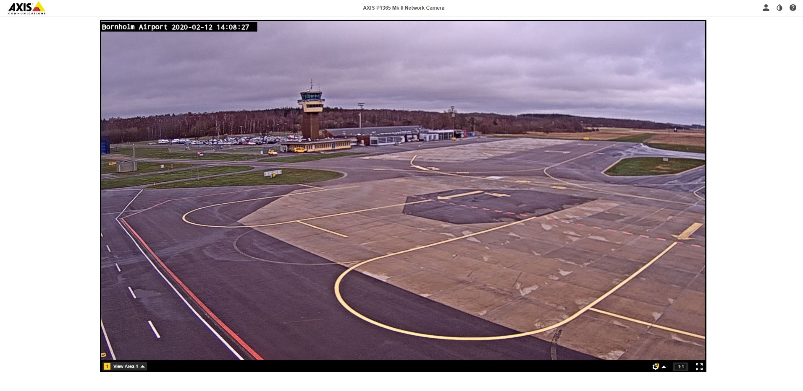

```
The special operations team has learned that a target of theirs always takes the first flight out of their local airport every morning.

Please find the TIME OF ARRIVAL AT DESTINATION of that first flight, so that we can place officers to arrest them.

Once again we have very little to go on, aside from what I think is a camera feed.

LIVE CAMERA FEED: http://87.54.59.228

If you're having trouble viewing it, we've also been given a screenshot by them, which is attached.

Please enter the time as HH:MM.
```



Since we know that the target is taking off from Bornholm Airport, we need to go to their website and see the information pertaining to outbound flights. After some digging, it was determined that the website is available at https://www.bornholms-lufthavn.dk/.

Looking at several dates on the [flights page](https://www.bornholms-lufthavn.dk/passager/flytider) indicates that the first flight every morning, DX031, takes off at 06:15 to Copenhagen. [Travel Math](https://www.travelmath.com/flying-time/from/RNN/to/CPH) tells us that the flight takes between 40-41 minutes, so we can assume that the target arrives at 06:55.
